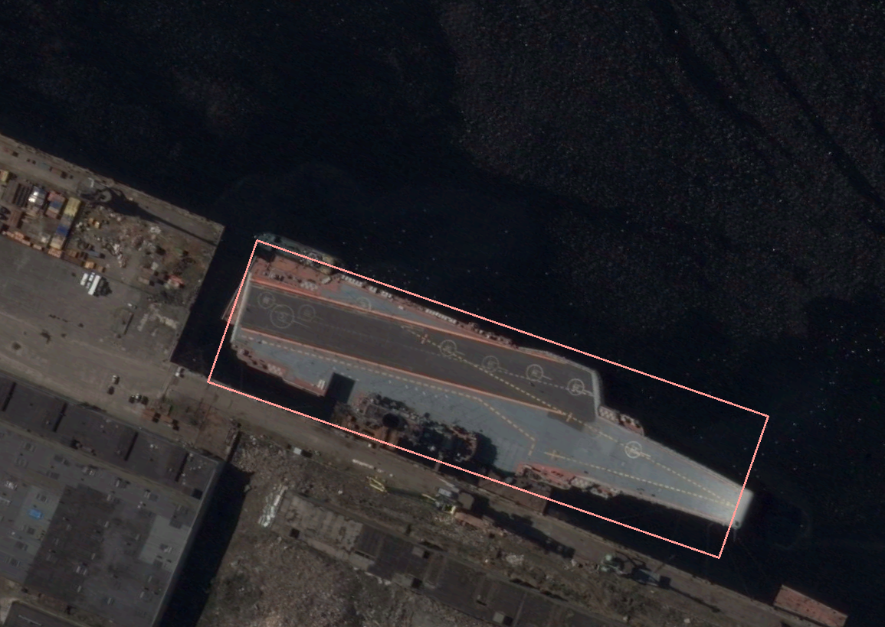

#  YOLOv5 for Oriented Object Detection use kld loss and gwd loss

### 代码改进基于yolov5 + kld / gwd

# **Installation**

## Requirements

Linux

Python 3.7 +

Pytorch 1.7

CUDA 9.0 higher

## Install

cd yolov5-obb-kld

pip install -r requirements.txt

cd utils/nms_rotated

python setup.py develop

## Install DOTA_devkit

cd yolov5-obb-kld/DOTA_devkit

sudo apt-get install swig

swig -c++ -python polyiou.i

python setup.py build_ext --inplace

------

# **get start**

## Prepare custom dataset

prepare the labels format is [poly, classname,difficult]

[x1, y1, x2, y2, x3, y3, x4, y4, classname, difficult]

# 参考作者

hukaixuan19970627/yolov5_obb

name:"胡凯旋"

# 本文作者

name:"xingbing"
